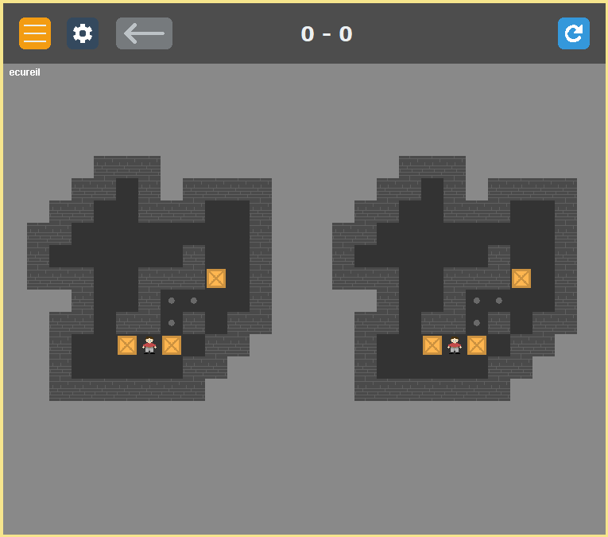

# L2-Sokoban-Astar-solver
A sokoban written in Java that allows to play in parallel against an AI (solver A*)

Features:
- gui
- Sokoban XSB file format support (load)
- step by step AI (A*)
- sounds support
- menus and options
- themes and characters selection 
- back and reset button
- gui scaling

  
 
